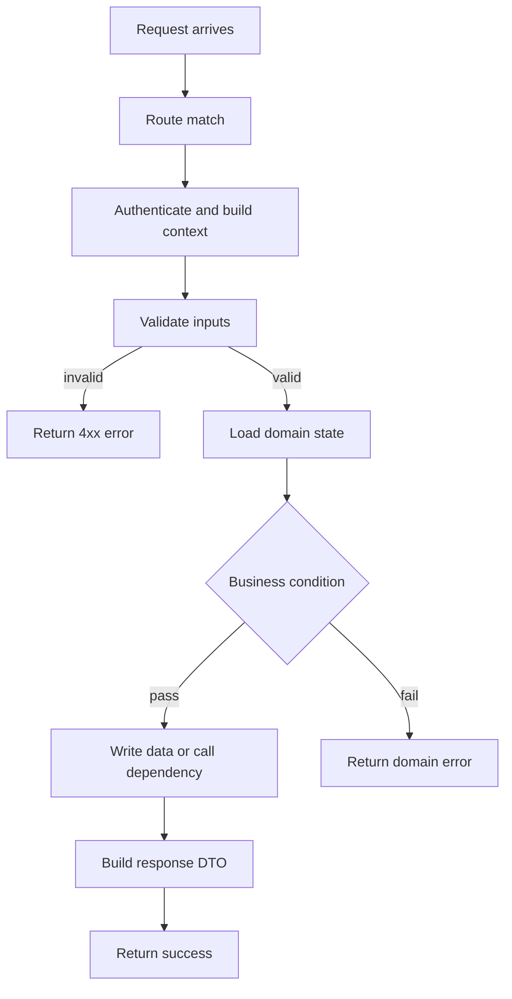

# Endpoint Analysis Template

Use this template for full endpoint analysis. Remove sections that are irrelevant to the endpoint, but keep request, response, flow, errors, and evidence unless the user asked for a brief answer.

## 1. 接口概述

| 项目 | 内容 |
| --- | --- |
| Endpoint | `METHOD /path` |
| 作用 | 用一句话说明接口目标 |
| Handler / Controller | 入口函数或类 |
| 鉴权/权限 | 无 / Optional / Required，说明方式和权限点 |
| Content-Type | `application/json`、`multipart/form-data` 等 |
| 执行语义 | 同步 / 异步任务 / 流式 / webhook ack |
| 幂等性 | 幂等 / 非幂等 / 条件幂等，说明依据 |
| 关键依赖 | DB、Cache、MQ、外部 API、对象存储等 |

补充：上游调用方、版本约束、feature flag、tenant、环境变量、middleware 注入行为。

## 2. 请求结构及参数说明

### 2.1 请求入口

- Path params / Query params
- Headers / Cookies
- Body / Form / Multipart files
- 隐式上下文：用户身份、tenant、trace id、feature flags、session 等

### 2.2 参数明细表

| 参数 | 位置 | 类型 | 必填 | 默认值 | 校验/约束 | 说明 |
| --- | --- | --- | --- | --- | --- | --- |
| `example` | query | `string` | 是 | 无 | 长度 <= 64 | 示例 |

### 2.3 请求前置条件

- 鉴权、权限、租户隔离
- 资源存在性、状态机前置条件
- 限流、配额、去重、幂等键
- 文件大小/类型、schema、业务校验

## 3. 响应结构

### 3.1 成功响应

| 状态码 | 条件 | Body 结构 | 关键响应头 |
| --- | --- | --- | --- |
| `200` | 正常成功 | `{...}` | 无 |

### 3.2 字段说明

| 字段 | 类型 | 来源 | 含义 |
| --- | --- | --- | --- |
| `data.id` | `string` | DB 主键 | 资源 ID |

### 3.3 响应特性

- 分页、游标、排序、过滤
- 脱敏字段、条件字段、多态响应
- 异步受理响应，例如 `202 Accepted`
- 流式返回、文件下载、重定向、响应 cookies

## 4. 业务流程

复杂流程先给 Mermaid；简单流程可只用步骤列表。

关键说明：

- 主要分支条件
- 外部依赖调用
- 数据读写、状态变更、事务边界
- 事件发布、异步任务、缓存刷新/失效
- 超时、取消、重试、补偿、回滚点

## 5. 错误处理说明

| 状态码 / 错误码 | 触发条件 | 来源层级 | 返回内容 | 备注 |
| --- | --- | --- | --- | --- |
| `400` | 参数校验失败 | Handler / Schema | `{error: ...}` | 示例 |

覆盖以下层级：

- Boundary errors：请求格式、参数校验、鉴权、权限、租户、限流
- Domain errors：业务前置条件不满足、状态冲突、资源不存在
- Infrastructure errors：DB、Cache、外部 API、网络、超时
- Framework defaults：未捕获异常、默认 404/405/422 等

## 6. 补充分析

按需要补充以下内容：

- Side effects：写库、发消息、写对象存储、调用第三方、缓存失效
- 一致性：强一致、最终一致、失败补偿、重试
- 安全性：鉴权、越权风险、输入污染、敏感字段暴露
- 可观测性：日志、metrics、tracing、审计
- 测试覆盖：现有单测、集成测试、端到端测试，及缺口
- 风险与开放问题：实现与文档不一致、未验证分支、潜在回归点

## 7. 证据清单

- 列出关键文件路径、函数名、模型名、测试名或 spec 位置。
- 对每个重要结论标记来源；依赖推断时写明依据。
- 明确哪些行为未验证，例如实现代码不可见、测试未覆盖、运行时配置未知。
